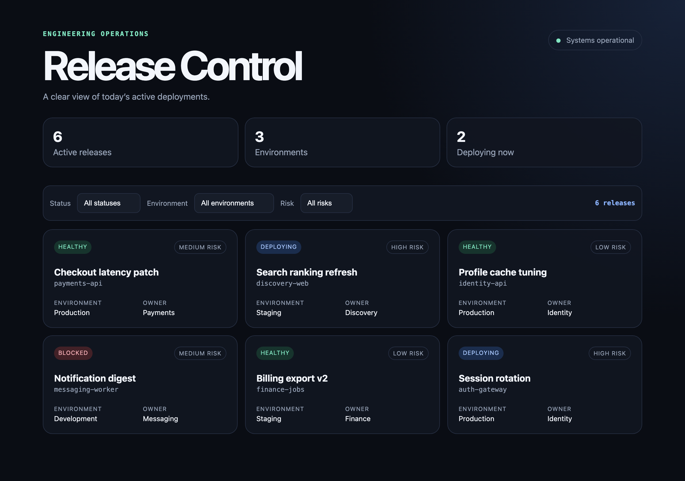

# Ship a Parallel Developer Dashboard Release with Isolated Git Worktrees

**In this codelab you run peer AI agents in parallel, each in its own isolated Git worktree**, then integrate their changesets into one verified release — so concurrent agents never edit the same working copy or tangle shared Git history.

A hands-on lesson in concurrent agent workspaces: three agents work in parallel
inside isolated Git worktrees, turning independent features into reviewable
branches that never touch your live code. You practice merge ordering, conflict
resolution that preserves both agents' intent, combined verification, and safe
promotion — the integration discipline that parallel agent development actually
requires.

**▶️ Start the codelab:** https://happycode.studio/gde-sprint-26-worktrees-public/

## What you'll build

A "Release Control" dashboard with environment filtering, risk filtering, and
accessibility improvements — each built by a separate agent, then merged and
verified into one release.



## Get the starter files

This repo also hosts the published codelab, so you don't need the whole thing.
Pull down just the `workspace/` folder with a sparse checkout — that folder is
your working directory, no copy step needed:

```bash
git clone --no-checkout --depth 1 https://github.com/evanca/gde-sprint-26-worktrees-public.git
cd gde-sprint-26-worktrees-public
git sparse-checkout init --cone
git sparse-checkout set workspace
git checkout
cd workspace
git init -b main
git add .
git commit -m "Add finished release dashboard starter"
```

- `workspace/` — the finished release dashboard you start from; the codelab's
  peer agents add features to it across isolated worktrees.
- [`reference/`](./reference) — the completed integrated build, for comparison if
  your result differs.

Follow the [codelab](https://happycode.studio/gde-sprint-26-worktrees-public/)
from here.

---

Google Cloud credits were provided for this project as part of the Agentic Architect Sprint 2026.

#AgenticArchitect #GoogleAntigravity
